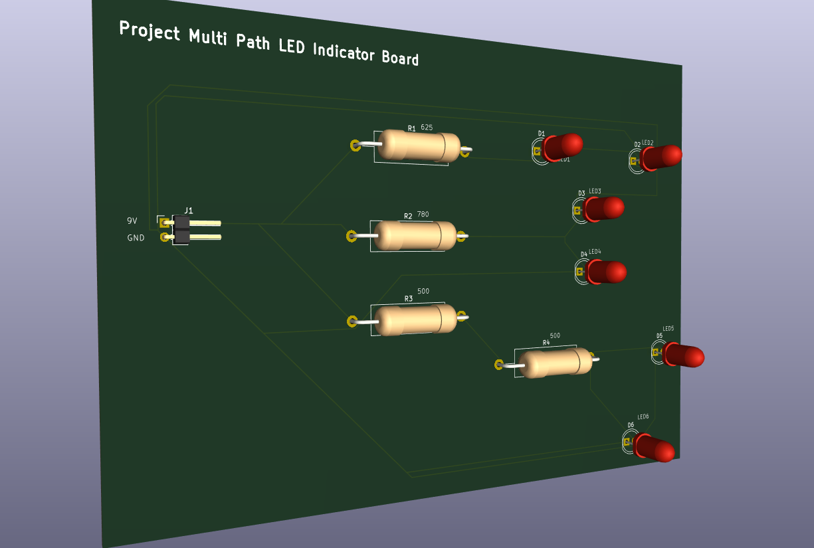
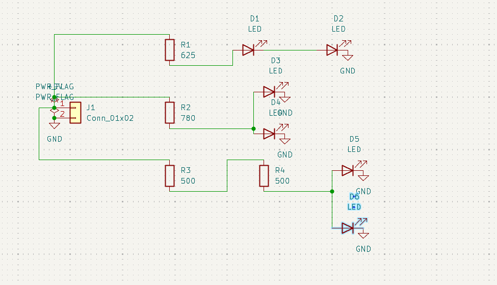
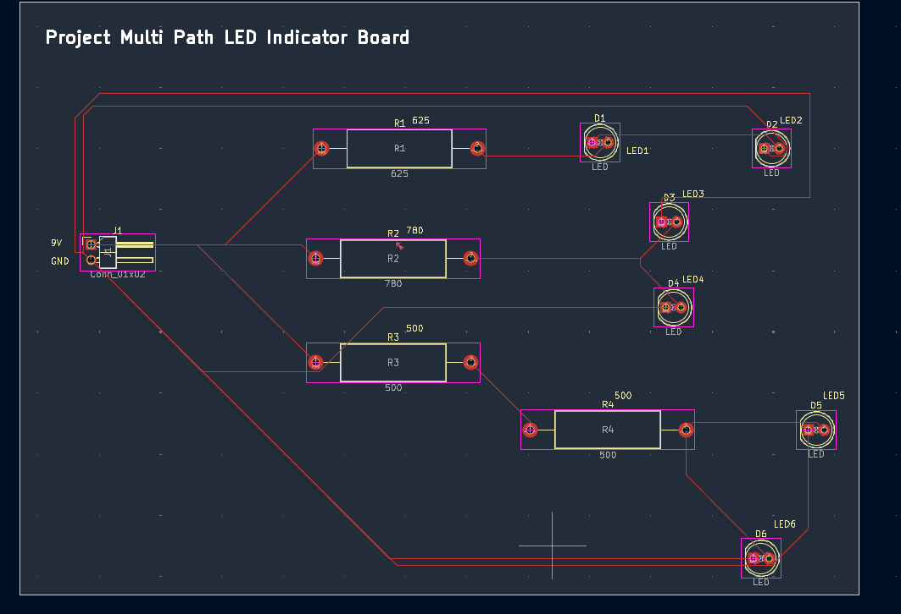
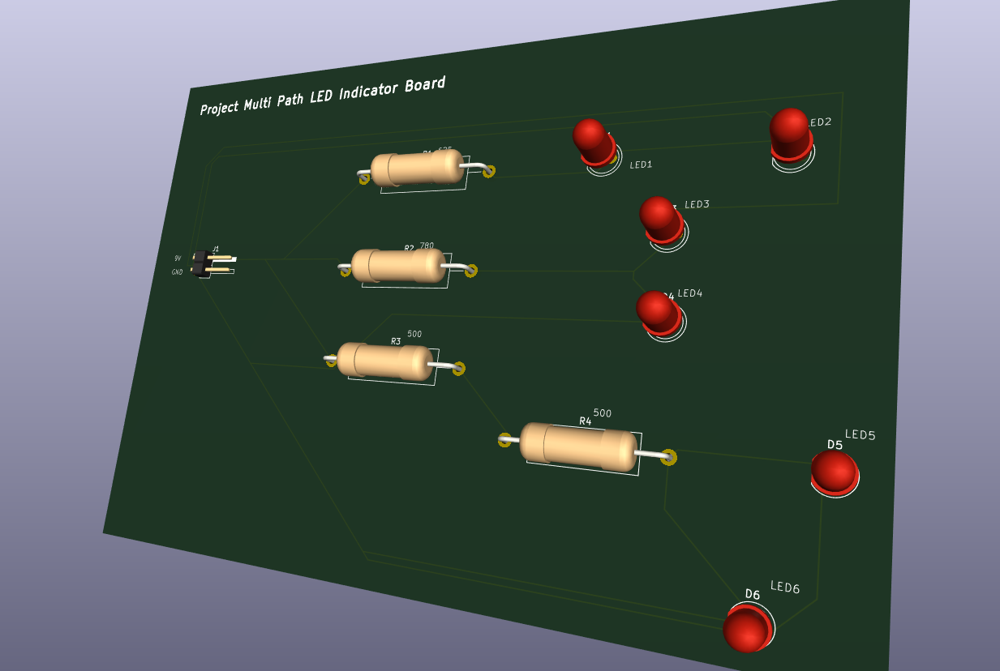

# Project Multi Path LED Indicator Board

A 9 V through-hole KiCad project created as a self-directed exercise in mixed **series/parallel circuit analysis**, resistor sizing, current splitting, PCB design, and design verification.

The project deliberately combines different branch structures rather than repeating the same resistor-and-LED branch six times.



## Project origin

The exercise brief was generated by **ChatGPT (OpenAI, GPT-5.6 Sol)** at the my request as part of a hands-on electronics learning session.

I then independently selected the final topology, performed the branch calculations, created and corrected the schematic, assigned footprints, routed the PCB, added silkscreen, and completed the KiCad design workflow with review.

My polished user request is preserved in [`docs/user-request.md`](docs/user-request.md), and the revised six-LED exercise brief is preserved in [`docs/project-brief-chatgpt.md`](docs/project-brief-chatgpt.md).

## Given design targets

| Parameter | Value |
|---|---:|
| Supply voltage | 9 V |
| Desired total current | ≈ 24 mA |
| Assumed LED forward voltage | ≈ 2 V |
| LEDs | 6 |
| Construction | Through-hole |
| PCB | 2-layer |

## Final circuit architecture

### Branch 1 — series LEDs

```text
+9V -> R1 625Ω -> D1 -> D2 -> GND
```

D1 and D2 are in series, so their forward-voltage drops add.

### Branch 2 — shared resistor with parallel LEDs

```text
                         +-> D3 -> GND
+9V -> R2 780Ω -> node
                         +-> D4 -> GND
```

The branch current reaches a junction and splits between D3 and D4.

### Branch 3 — series resistors with parallel LEDs

```text
                                      +-> D5 -> GND
+9V -> R3 500Ω -> R4 500Ω -> node
                                      +-> D6 -> GND
```

R3 and R4 are in series, giving a total resistance of 1000 Ω before the current splits between D5 and D6.

## Electrical results

| Branch | Resistor arrangement | LED arrangement | Approx. branch current |
|---|---|---|---:|
| 1 | R1 = 625 Ω | D1 + D2 series | 8.00 mA |
| 2 | R2 = 780 Ω | D3 / D4 parallel | 8.97 mA total |
| 3 | R3 + R4 = 1000 Ω | D5 / D6 parallel | 7.00 mA total |

Approximate total current:

```text
It ≈ 8.00 + 8.97 + 7.00
It ≈ 23.97 mA
```

This closely matches the 24 mA design target.

Full derivations are in [`docs/calculations.md`](docs/calculations.md).

## Important design limitation

Branches 2 and 3 use **parallel LEDs sharing upstream current-limiting resistance**.

The calculations assume identical LEDs and equal current sharing. Real LEDs have forward-voltage tolerances, so current will not necessarily divide equally. One LED can conduct more current than the other.

For a robust real-world design, each parallel LED would normally use its own resistor or an appropriate constant-current circuit.

This topology is intentionally retained as a learning example because it demonstrates the difference between:

- total current through an upstream resistor;
- current splitting at a junction;
- same voltage across parallel paths;
- voltage addition in series paths.

See [`docs/design-limitations.md`](docs/design-limitations.md).

## Schematic



## PCB layout



The current board is a through-hole design using a 1.6 mm, 2-layer PCB definition. The routed design contains no vias.

## 3D views




## Bill of materials

See [`BOM.csv`](BOM.csv).

Main components:

- 1 × 2-pin power connector
- 1 × 625 Ω resistor
- 1 × 780 Ω resistor
- 2 × 500 Ω resistors
- 6 × 5 mm through-hole LEDs

## KiCad source

Source files are under [`kicad/`](kicad/):

```text
Project-Multi-Path-LED-Indicator-Board.kicad_pro
Project-Multi-Path-LED-Indicator-Board.kicad_sch
Project-Multi-Path-LED-Indicator-Board.kicad_pcb
```

The local `.kicad_prl` preferences file is intentionally excluded from version control.

## Verification

The design workflow includes:

- schematic review
- LED polarity verification
- ERC
- schematic-to-PCB synchronization
- footprint assignment
- PCB routing
- Edge.Cuts
- silkscreen
- DRC
- schematic/PCB parity check
- 3D inspection

## Fabrication outputs

Final Gerber and drill files are included under [`fabrication/`](fabrication/).

A manufacturer-ready convenience package is also included:

```text
fabrication/Project-Multi-Path-LED-Indicator-Board-Gerbers.zip
```

The export includes copper, solder-mask, silkscreen, paste, board-outline, Gerber-job, PTH drill, and NPTH drill files. Because this is a through-hole board, the paste layers are not required for normal manual assembly but are retained as part of the complete KiCad export.

## Repository structure

```text
.
├── README.md
├── BOM.csv
├── .gitignore
├── .gitattributes
├── kicad/
├── docs/
├── images/
└── fabrication/
```

## Learning focus

This project was built to strengthen:

- Ohm's law
- voltage drops
- node-voltage reasoning
- series LED analysis
- parallel branch voltage
- current splitting
- series resistor equivalence
- resistor power
- total supply-current calculation
- LED polarity
- schematic-to-PCB translation
